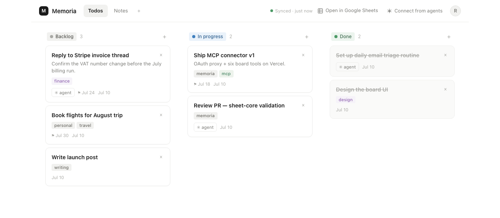

# Memoria

**Memoria** — a quiet memory for you and your agents, over Google Sheets you own.
A kanban todo board whose only backend is a Google Sheet in your own Drive.
Two clients read and write that sheet: a web app (the board UI) and an MCP
server (for coding agents like Claude Code or Codex). Neither holds state —
the sheet is the single source of truth, so your board, your agents, and
Google Sheets itself are always looking at the same data.



No servers, no database, no stored user credentials. The web app is
static files plus a stateless MCP endpoint; the only credential involved
is your own Google sign-in. Your tasks live in a plain spreadsheet you
own, readable forever with or without this app.

See `docs/ARCHITECTURE.md` for the full design.

## Two ways to use it

**Just want a board?** Use a hosted instance — for example
[memoria-board.vercel.app](https://memoria-board.vercel.app). Sign in
with Google, click **+ New board**, and you have a kanban board backed by a
sheet in your own Drive. The app can only touch files it created or that
you explicitly picked (`drive.file` scope) — never the rest of your Drive —
and the deployment stores nothing about you anywhere.

**Want your own instance, or agent access?** Fork this repo and follow
**[docs/SETUP.md](docs/SETUP.md)** (~15 minutes: your own free Google Cloud
credentials, your own Vercel deploy).

**Connecting your agents?** Every deployment serves an MCP connector at
`https://<deployment>/api/mcp`: add it in claude.ai (Settings →
Connectors) or Claude Code (`claude mcp add --transport http …`), sign in
with Google, and your agent gets the board tools against your own
boards — nothing to install, and it works in scheduled and cloud routines
too. The app's **Connect from agents** panel walks you through it; see
[docs/SETUP.md](docs/SETUP.md#8-enable-the-mcp-connector-5-min) for the
three env vars that switch it on for a fork.

## Quickstart (local development)

Once you have credentials from [docs/SETUP.md](docs/SETUP.md):

```bash
git clone <this repo>
cd Memoria
npm install
cp apps/web/.env.example apps/web/.env   # fill in your client ID / API key
npm run dev --workspace=@memoria/web
```

## Monorepo map

```
apps/web              React + TypeScript + Vite SPA — the board UI
packages/sheet-core    Shared schema, validation, and ordering logic (no runtime deps)
packages/mcp-server    The six MCP board tools (mounted by apps/web/api over HTTP)
docs/                  Architecture, setup guide, design mockup
```

- **`packages/sheet-core`** is the single definition of what a valid Memoria
  sheet is — both other packages depend on it. It's tested exhaustively
  since it's the thing standing between a typo and your data.
- **`apps/web`** talks to Google Sheets/Drive directly via `fetch` using an
  OAuth token scoped to `drive.file` (it can only see files it created or
  you explicitly picked).
- **`packages/mcp-server`** defines the tools (`list_boards`, `list_tasks`,
  `add_task`, `update_task`, `move_task`, `complete_task`, `delete_task`),
  transport-free; the Vercel function in `apps/web/api` serves them as a
  remote MCP connector authenticated with each caller's own Google account.

## Scripts (from the repo root)

```bash
npm run typecheck   # tsc --noEmit across all workspaces
npm run lint         # eslint .
npm run test          # vitest run across all workspaces
npm run build         # build every workspace (sheet-core first)
```

## License

MIT
